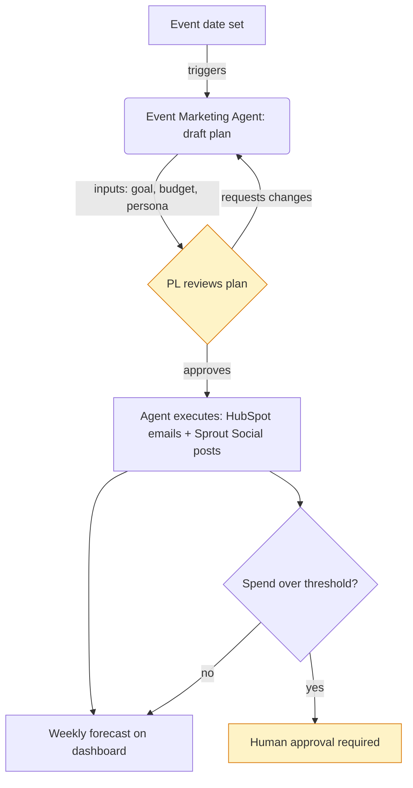

# Workflow diagram conventions

Produce both diagrams as Mermaid `graph TD` (top-down flowchart). Rules, in priority order:

1. **The human is always a visible node** in both diagrams — never let a diagram collapse to purely system-to-system boxes. The entire point of the "without agent" vs. "with agent" pair is to show what moves from the human's plate onto the agent's.
2. **Every edge gets a label** describing the action or handoff (e.g. `-->|drafts email|`, `-->|approves|`). Unlabeled arrows are the most common mistake — don't leave any.
3. **Every node needs a real label**, not a generic "Step 1" — name the actual action, system, or role.
4. **Show the exception/rejection path**, not just the happy path — e.g. what happens when a draft is rejected, or a plan needs revision. At minimum one branch per diagram should show a "needs changes" loop back.
5. **Keep it to ~10–15 nodes.** If the real process is bigger, split into an overview + a detail diagram rather than cramming one dense graph.
6. **Color/style human-gate nodes distinctly** (e.g. a `classDef gate` with a different fill) so approval checkpoints are visually obvious at a glance in the "with agent" diagram.

## Diagram 1 — workflow without the agent

Show the process as it happens today, entirely human-driven, across whatever manual tools/systems are used (spreadsheets, email, the raw SaaS tool UI, Slack, etc.). This is the baseline the agent is meant to improve on — pull the "Human who performs this today" and "Systems" fields from the Agent Definition File to populate it. Include realistic friction points (waiting on approval, manual re-entry between tools, no tracking) since those are exactly what the agent should remove.

## Diagram 2 — workflow with the agent

Show the same end-to-end process, now with the agent inserted, following the six-step loop as the backbone: **User intent → Plan → Approve → Execute → Report → Learn**. Map every field from the Agent Definition File onto the diagram:
- The **Trigger** is the entry node.
- The **Inputs** feed into the agent's Plan step.
- The **Human Gate(s)** must appear as explicit approval nodes before Execute.
- The **Systems** the agent integrates with appear as the nodes it acts on during Execute.
- The **Output** is the terminal node (or feeds into "Report").
- If a **boundary condition** exists (max iterations, escalation), show it as a branch: e.g. "revisions < limit? → back to Plan" vs. "limit reached → escalate to human."

## Example skeleton (adapt, don't copy verbatim)

## Rendering to image

After drafting both `.mermaid` sources, run `scripts/render_mermaid.sh <input.mmd> <output.png>` to rasterize each into a PNG (uses `npx @mermaid-js/mermaid-cli` under the hood — requires Node available in the environment). Embed the resulting PNGs in the Word version of the Agent Definition File; keep the raw `.mermaid` text in the Markdown version so it stays editable. If rendering fails (e.g. no Node/network in the sandbox), fall back to including the Mermaid source as a labeled code block in both formats and tell the user the diagram can be pasted into mermaid.live or any Mermaid-aware editor to view it.
