# LFX Marketing OS — 6-Month Agent Roadmap

Maintained weekly by the **Marketing OS Product Manager Agent** (runs Sunday nights). Source of truth: [`roadmap.csv`](roadmap.csv). Static image: [`gantt.png`](gantt.png).

**Assumptions:** 26 weeks starting Mon 2026-09-14; max 3 agents/week; reduced capacity Thanksgiving week (2) and the two holiday weeks (1 each). 21 agents already shipped in `plugins/`. **Now** = weeks 1–2, **Next** = weeks 3–4, **Later** = weeks 5–26.

**Sequencing logic:** finish the Plan chain (Qtrly Plan → Campaign Plan → Hot Campaign) → unblock social listening for all pilot users → Newsletter (LFX highest priority) → content/creation agents requested by Marcom, Events, Education, CNCF, AAIF → execution and monitoring agents that depend on LFX epics (#1613 campaign platform, #1679 dashboards, #1697 email, #2260 newsletters).

```mermaid
gantt
  title LFX Marketing OS — Agent Build Roadmap (Sep 14, 2026 → Mar 12, 2027, ≤3 agents/week)
  dateFormat YYYY-MM-DD
  axisFormat %b %d
  excludes weekends
  section W01 2026-09-14
    marketing-os-product-manager :active, marketing_os_product_manager, 2026-09-14, 5d
    qtrly-campaign-plan-agent :active, qtrly_campaign_plan_agent, 2026-09-14, 5d
    marketing-data-sources :active, marketing_data_sources, 2026-09-14, 5d
  section W02 2026-09-21
    hot-campaign-orchestration :active, hot_campaign_orchestration, 2026-09-21, 5d
    social-listening-setup :active, social_listening_setup, 2026-09-21, 5d
    campaign-copy :active, campaign_copy, 2026-09-21, 5d
  section W03 2026-09-28
    newsletter-composition :crit, newsletter_composition, 2026-09-28, 5d
    trend-spike-detection :crit, trend_spike_detection, 2026-09-28, 5d
    proposal-agent :crit, proposal_agent, 2026-09-28, 5d
  section W04 2026-10-05
    editorial-calendar :crit, editorial_calendar, 2026-10-05, 5d
    landing-page :crit, landing_page, 2026-10-05, 5d
    executive-briefing :crit, executive_briefing, 2026-10-05, 5d
  section W05 2026-10-12
    launch-plan :launch_plan, 2026-10-12, 5d
    new-member-announcement :new_member_announcement, 2026-10-12, 5d
    social-post-and-calendar :social_post_and_calendar, 2026-10-12, 5d
  section W06 2026-10-19
    blog-post :blog_post, 2026-10-19, 5d
    event-website-qa :event_website_qa, 2026-10-19, 5d
    comparative-content :comparative_content, 2026-10-19, 5d
  section W07 2026-10-26
    member-news-monitor :member_news_monitor, 2026-10-26, 5d
    marketing-recap :marketing_recap, 2026-10-26, 5d
    webinar-promo-recap :webinar_promo_recap, 2026-10-26, 5d
  section W08 2026-11-02
    structured-campaign-brief :structured_campaign_brief, 2026-11-02, 5d
    abm-targeted-list :abm_targeted_list, 2026-11-02, 5d
    email-sequence-planner :email_sequence_planner, 2026-11-02, 5d
  section W09 2026-11-09
    post-webinar-followup :post_webinar_followup, 2026-11-09, 5d
    member-edu-outreach-content :member_edu_outreach_content, 2026-11-09, 5d
    google-slides-template :google_slides_template, 2026-11-09, 5d
  section W10 2026-11-16
    marketing-performance-action :marketing_performance_action, 2026-11-16, 5d
    okr-tracking :okr_tracking, 2026-11-16, 5d
    project-health-narrative :project_health_narrative, 2026-11-16, 5d
  section W11 2026-11-23
    meetup-kit :meetup_kit, 2026-11-23, 5d
    minor-release-checklist :minor_release_checklist, 2026-11-23, 5d
  section W12 2026-11-30
    cfp-review :cfp_review, 2026-11-30, 5d
    ambassador-application-review :ambassador_application_review, 2026-11-30, 5d
    ambassador-nomination :ambassador_nomination, 2026-11-30, 5d
  section W13 2026-12-07
    event-execution :event_execution, 2026-12-07, 5d
    speaker-promotion-kit :speaker_promotion_kit, 2026-12-07, 5d
    post-event-content :post_event_content, 2026-12-07, 5d
  section W14 2026-12-14
    local-outreach :local_outreach, 2026-12-14, 5d
    reg-pace-tracker :reg_pace_tracker, 2026-12-14, 5d
    stakeholder-communication :stakeholder_communication, 2026-12-14, 5d
  section W15 2026-12-21
    whitepaper-ebook :whitepaper_ebook, 2026-12-21, 5d
  section W16 2026-12-28
    canva-brand-kit :canva_brand_kit, 2026-12-28, 5d
  section W17 2027-01-04
    media-mix-planner :media_mix_planner, 2027-01-04, 5d
    ad-copy-variants :ad_copy_variants, 2027-01-04, 5d
    ad-spend-monitor :ad_spend_monitor, 2027-01-04, 5d
  section W18 2027-01-11
    audience-segmentation :audience_segmentation, 2027-01-11, 5d
    engagement-scorer :engagement_scorer, 2027-01-11, 5d
    list-hygiene-and-sync :list_hygiene_and_sync, 2027-01-11, 5d
  section W19 2027-01-18
    youtube-to-wordpress :youtube_to_wordpress, 2027-01-18, 5d
    video-clipper :video_clipper, 2027-01-18, 5d
    owned-media-production :owned_media_production, 2027-01-18, 5d
  section W20 2027-01-25
    podcast-setup :podcast_setup, 2027-01-25, 5d
    youtube-channel-setup :youtube_channel_setup, 2027-01-25, 5d
    owned-media-flywheel :owned_media_flywheel, 2027-01-25, 5d
  section W21 2027-02-01
    certification-awareness :certification_awareness, 2027-02-01, 5d
    affiliate-program-monitor :affiliate_program_monitor, 2027-02-01, 5d
    course-launch-planner :course_launch_planner, 2027-02-01, 5d
  section W22 2027-02-08
    social-amplification :social_amplification, 2027-02-08, 5d
    creative-agent :creative_agent, 2027-02-08, 5d
    image-brief-generator :image_brief_generator, 2027-02-08, 5d
  section W23 2027-02-15
    member-onboarding :member_onboarding, 2027-02-15, 5d
    renewal-planner :renewal_planner, 2027-02-15, 5d
    member-churn-signals :member_churn_signals, 2027-02-15, 5d
  section W24 2027-02-22
    github-activity-monitor :github_activity_monitor, 2027-02-22, 5d
    contributor-recognition :contributor_recognition, 2027-02-22, 5d
    adoption-tracker :adoption_tracker, 2027-02-22, 5d
  section W25 2027-03-01
    board-deck :board_deck, 2027-03-01, 5d
    budget-planner :budget_planner, 2027-03-01, 5d
    consent-setup :consent_setup, 2027-03-01, 5d
  section W26 2027-03-08
    ab-test-evaluator :ab_test_evaluator, 2027-03-08, 5d
    web-analytics-reporter :web_analytics_reporter, 2027-03-08, 5d
    roadmap-replan :roadmap_replan, 2027-03-08, 5d
```

## Week-by-week

| Wk | Week of | Agent | Area | Type | Requested by / source | Status |
|---|---|---|---|---|---|---|
| 1 | 2026-09-14 | `marketing-os-product-manager` | Program | Plan | Paul | **Now** |
| 1 | 2026-09-14 | `qtrly-campaign-plan-agent` | Planning | Plan | Paul / Jim | **Now** |
| 1 | 2026-09-14 | `marketing-data-sources` | Foundation Setup | Reference | Paul | **Now** |
| 2 | 2026-09-21 | `hot-campaign-orchestration` | Outbound – Cross-channel | Plan | CNCF (Holistic Campaign Orchestration); Nirav (Guild e2e use case) | **Now** |
| 2 | 2026-09-21 | `social-listening-setup` | Outbound – Social | Reference | Deck: Agent #3 (TBD) | **Now** |
| 2 | 2026-09-21 | `campaign-copy` | Outbound – Cross-channel | Create | Events | **Now** |
| 3 | 2026-09-28 | `newsletter-composition` | Outbound – Email | Create | LF Media; LFX Tier 2 'HIGHEST PRIORITY' (LFXV2-2681–2684) | **Next** |
| 3 | 2026-09-28 | `trend-spike-detection` | Outbound – Social | Monitor | Deck: Agent #2; All personas (weekly digest) | **Next** |
| 3 | 2026-09-28 | `proposal-agent` | Memberships | Create | OpenSearch (Lisa) – Designing | **Next** |
| 4 | 2026-10-05 | `editorial-calendar` | Content Production | Plan | CNCF; Allison (#39) | **Next** |
| 4 | 2026-10-05 | `landing-page` | Outbound – Web | Create | Events (HubSpot landing pages) | **Next** |
| 4 | 2026-10-05 | `executive-briefing` | Events | Monitor | Events | **Next** |
| 5 | 2026-10-12 | `launch-plan` | Foundation Setup | Plan | Allison P1 (Marcom playbook, #7) | **Later** |
| 5 | 2026-10-12 | `new-member-announcement` | Memberships | Create | Allison (#26) | **Later** |
| 5 | 2026-10-12 | `social-post-and-calendar` | Outbound – Social | Create | Core Agent #3; LFX Tier 2 (LFXV2-2405) | **Later** |
| 6 | 2026-10-19 | `blog-post` | Content Production | Create | Allison (#10 blog template) | **Later** |
| 6 | 2026-10-19 | `event-website-qa` | Events | Monitor | Events | **Later** |
| 6 | 2026-10-19 | `comparative-content` | Content Production | Create | Education | **Later** |
| 7 | 2026-10-26 | `member-news-monitor` | Memberships | Monitor | CNCF (LFX Lens) | **Later** |
| 7 | 2026-10-26 | `marketing-recap` | Business Outcomes | Monitor | Allison 'Showcasing Results' (#38) | **Later** |
| 7 | 2026-10-26 | `webinar-promo-recap` | Events | Create | Allison; Events (#18) | **Later** |
| 8 | 2026-11-02 | `structured-campaign-brief` | Outbound – Cross-channel | Plan | Demand Gen (#31) | **Later** |
| 8 | 2026-11-02 | `abm-targeted-list` | Memberships | Plan | Demand Gen (#29) | **Later** |
| 8 | 2026-11-02 | `email-sequence-planner` | Outbound – Email | Plan | Education (#28 Lifecycle Nurture) | **Later** |
| 9 | 2026-11-09 | `post-webinar-followup` | Education | Execute | Education (enterprise + public variants) | **Later** |
| 9 | 2026-11-09 | `member-edu-outreach-content` | Education | Create | Education | **Later** |
| 9 | 2026-11-09 | `google-slides-template` | Foundation Setup | Reference | Creative Services | **Later** |
| 10 | 2026-11-16 | `marketing-performance-action` | Business Outcomes | Monitor | Events; CNCF (review w/ Misha dashboards) (#36) | **Later** |
| 10 | 2026-11-16 | `okr-tracking` | Foundation Setup | Monitor | LFX Tier 1 (#37) | **Later** |
| 10 | 2026-11-16 | `project-health-narrative` | Foundation Setup | Monitor | LFX Tier 1 (#35, LFXV2-2148) | **Later** |
| 11 | 2026-11-23 | `meetup-kit` | Events | Create | Allison (Meetup Guidelines, #17) | **Later** |
| 11 | 2026-11-23 | `minor-release-checklist` | Content Production | Execute | Allison (#11) | **Later** |
| 12 | 2026-11-30 | `cfp-review` | Events | Execute | AAIF | **Later** |
| 12 | 2026-11-30 | `ambassador-application-review` | Adoption (Community) | Execute | AAIF | **Later** |
| 12 | 2026-11-30 | `ambassador-nomination` | Adoption (Community) | Execute | #30 | **Later** |
| 13 | 2026-12-07 | `event-execution` | Events | Execute | Core Agent #5 (#13) | **Later** |
| 13 | 2026-12-07 | `speaker-promotion-kit` | Events | Create | #15 | **Later** |
| 13 | 2026-12-07 | `post-event-content` | Events | Create | #16 | **Later** |
| 14 | 2026-12-14 | `local-outreach` | Events | Plan | Events | **Later** |
| 14 | 2026-12-14 | `reg-pace-tracker` | Events | Monitor | Landscape | **Later** |
| 14 | 2026-12-14 | `stakeholder-communication` | Program | Monitor | Events | **Later** |
| 15 | 2026-12-21 | `whitepaper-ebook` | Content Production | Create | Allison (#22) | **Later** |
| 16 | 2026-12-28 | `canva-brand-kit` | Foundation Setup | Reference | Creative Services | **Later** |
| 17 | 2027-01-04 | `media-mix-planner` | Outbound – Paid | Plan | Misha; LFX Tier 2 HIGH PRIORITY (LFXV2-2023) | **Later** |
| 17 | 2027-01-04 | `ad-copy-variants` | Outbound – Paid | Create | Misha | **Later** |
| 17 | 2027-01-04 | `ad-spend-monitor` | Outbound – Paid | Monitor | Misha (#32) | **Later** |
| 18 | 2027-01-11 | `audience-segmentation` | Audience Development | Execute | Core Agent #6 (#25, LFXV2-2252) | **Later** |
| 18 | 2027-01-11 | `engagement-scorer` | Audience Development | Monitor | Landscape; funnel Viable/Warm/Hot | **Later** |
| 18 | 2027-01-11 | `list-hygiene-and-sync` | Outbound – Email | Plan | LFXV2-2393 Mailing List Sync | **Later** |
| 19 | 2027-01-18 | `youtube-to-wordpress` | Content Production | Execute | Education | **Later** |
| 19 | 2027-01-18 | `video-clipper` | Content Production | Create | Landscape; OpusClip | **Later** |
| 19 | 2027-01-18 | `owned-media-production` | Content Production | Execute | Core Agent #7 (#21) | **Later** |
| 20 | 2027-01-25 | `podcast-setup` | Content Production | Execute | #19 | **Later** |
| 20 | 2027-01-25 | `youtube-channel-setup` | Content Production | Execute | #20 | **Later** |
| 20 | 2027-01-25 | `owned-media-flywheel` | Content Production | Execute | #24 | **Later** |
| 21 | 2027-02-01 | `certification-awareness` | Education | Create | #34 | **Later** |
| 21 | 2027-02-01 | `affiliate-program-monitor` | Education | Monitor | Events/EDU | **Later** |
| 21 | 2027-02-01 | `course-launch-planner` | Education | Plan | Landscape | **Later** |
| 22 | 2027-02-08 | `social-amplification` | Outbound – Social | Monitor | Events | **Later** |
| 22 | 2027-02-08 | `creative-agent` | Content Production | Create | Events | **Later** |
| 22 | 2027-02-08 | `image-brief-generator` | Content Production | Create | Other Ideas | **Later** |
| 23 | 2027-02-15 | `member-onboarding` | Memberships | Execute | #27 (LFX released LFXV2-1344) | **Later** |
| 23 | 2027-02-15 | `renewal-planner` | Memberships | Plan | Landscape | **Later** |
| 23 | 2027-02-15 | `member-churn-signals` | Memberships | Monitor | Landscape | **Later** |
| 24 | 2027-02-22 | `github-activity-monitor` | Adoption (Community) | Monitor | #14 (CM-1262) | **Later** |
| 24 | 2027-02-22 | `contributor-recognition` | Adoption (Community) | Create | #15 (LFXV2-2547) | **Later** |
| 24 | 2027-02-22 | `adoption-tracker` | Adoption (Community) | Monitor | Landscape | **Later** |
| 25 | 2027-03-01 | `board-deck` | Planning | Create | Deck: QBR Board Deck | **Later** |
| 25 | 2027-03-01 | `budget-planner` | Foundation Setup | Plan | Landscape | **Later** |
| 25 | 2027-03-01 | `consent-setup` | Foundation Setup | Execute | #9b (LFXV2-1666) | **Later** |
| 26 | 2027-03-08 | `ab-test-evaluator` | Outbound – Cross-channel | Monitor | #33 | **Later** |
| 26 | 2027-03-08 | `web-analytics-reporter` | Outbound – Web | Monitor | Others suggested | **Later** |
| 26 | 2027-03-08 | `roadmap-replan` | Program | Plan | PM agent | **Later** |

_Last updated 2026-09-16 by the Marketing OS Product Manager Agent._
